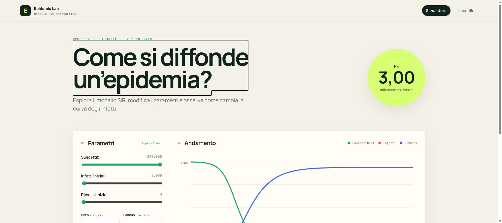
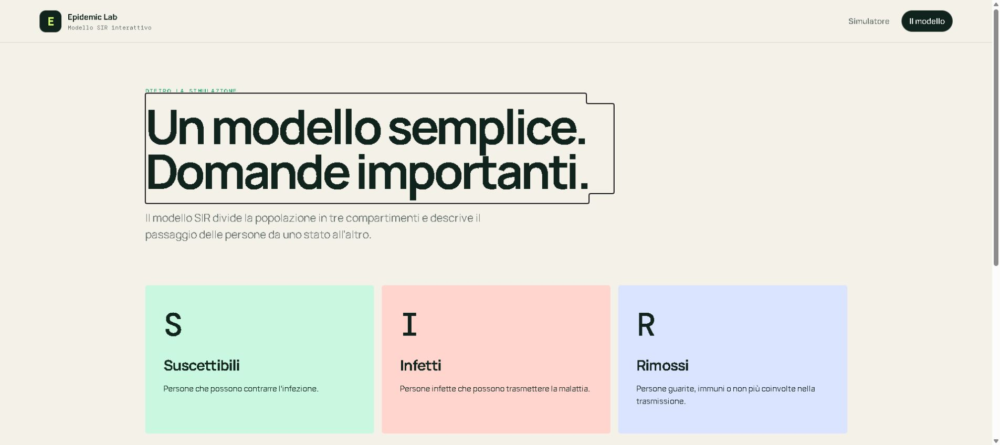

# Epidemic Lab

Simulatore epidemiologico interattivo basato sul modello matematico SIR, realizzato con Blazor WebAssembly e .NET 10.

Il progetto nasce come elaborato di maturità nel 2020 ed è stato completamente rinnovato nel 2026 per renderlo nuovamente compilabile, autonomo e adatto ai browser moderni.

## Anteprima

### Simulatore interattivo



### Spiegazione del modello



## Funzionalità

- simulazione dell'evoluzione di un'epidemia con il modello SIR;
- modifica in tempo reale di popolazione, infetti iniziali, beta, gamma e durata;
- calcolo automatico del numero di riproduzione di base `R₀`;
- grafico SVG responsive di suscettibili, infetti e rimossi;
- individuazione del giorno e del valore del picco degli infetti;
- scenari preconfigurati: contenuto, standard e aggressivo;
- tabella con i dati prodotti dalla simulazione;
- pagina didattica con equazioni, significato dei compartimenti e limiti del modello;
- funzionamento completamente locale, senza database, account o chiavi API.

## Tecnologie

| Area | Tecnologia |
| --- | --- |
| Interfaccia | Blazor WebAssembly |
| Framework | .NET 10 |
| Linguaggio | C# e Razor |
| Grafici | SVG nativo |
| Stile | CSS responsive personalizzato |
| Modello numerico | Runge-Kutta del quarto ordine |

Non vengono utilizzate librerie grafiche proprietarie o servizi esterni. Dopo il primo ripristino dei pacchetti .NET, la simulazione viene eseguita interamente nel browser.

## Requisiti

È sufficiente una delle seguenti configurazioni:

- Visual Studio 2026 con il workload per lo sviluppo ASP.NET e Web;
- .NET SDK 10 e un editor di codice a scelta.

Per controllare la versione installata:

```powershell
dotnet --version
```

## Avvio con Visual Studio

1. Aprire `EpidemicProject.sln`.
2. Attendere il completamento del ripristino NuGet.
3. Impostare `EpidemicProject.Client` come progetto di avvio, se non è già selezionato.
4. Premere `F5` per avviare con il debugger oppure `Ctrl+F5` per avviare senza debugger.

Il browser si aprirà automaticamente sull'indirizzo locale assegnato da Visual Studio.

## Avvio da terminale

Dalla cartella principale del repository:

```powershell
dotnet restore .\EpidemicProject.sln
dotnet run --project .\EpidemicProject.Client
```

Aprire nel browser l'indirizzo indicato dal comando, generalmente simile a `http://localhost:5000`.

## Compilazione e pubblicazione

Compilazione della soluzione:

```powershell
dotnet build .\EpidemicProject.sln --configuration Release
```

Produzione dei file statici distribuibili:

```powershell
dotnet publish .\EpidemicProject.Client --configuration Release
```

L'output viene generato in:

```text
EpidemicProject.Client/bin/Release/net10.0/publish/wwwroot/
```

## Struttura della soluzione

```text
EpidemicProject.sln
├── EpidemicProject.Client/       Applicazione Blazor WebAssembly
│   ├── Components/               Grafico SVG e componenti riutilizzabili
│   ├── Pages/                    Simulatore e pagina sul modello
│   ├── Shared/                   Layout e navigazione
│   └── wwwroot/                  CSS e risorse pubbliche
└── ClassLibrary1/                Libreria del dominio, assembly DAL
    ├── Models/                   Risultati della simulazione
    └── SimulationModels/         Implementazione del modello SIR
```

Le altre cartelle presenti nel repository appartengono agli esperimenti originali del 2020 e non fanno parte della soluzione eseguibile principale.

## Il modello SIR

Il modello SIR descrive una popolazione chiusa suddividendola, in ogni istante di tempo $t$, in tre compartimenti:

- $S(t)$ — persone **suscettibili**, che possono contrarre l'infezione;
- $I(t)$ — persone **infette** e in grado di trasmettere la malattia;
- $R(t)$ — persone **rimosse** dalla catena di trasmissione perché guarite, immuni o non più contagiose.

La popolazione totale è costante:

$$
N = S(t) + I(t) + R(t).
$$

### Equazioni differenziali

L'evoluzione dei tre compartimenti è descritta dal sistema:

$$
\begin{aligned}
\frac{dS}{dt} &= -\beta\frac{S I}{N}, \\
\frac{dI}{dt} &= \beta\frac{S I}{N} - \gamma I, \\
\frac{dR}{dt} &= \gamma I.
\end{aligned}
$$

Il termine $\beta SI/N$ rappresenta i nuovi contagi per unità di tempo. La quantità $I/N$ è la frazione infetta della popolazione e $\beta$ misura l'intensità dei contatti capaci di produrre un contagio. Il termine $\gamma I$ rappresenta invece le persone che escono dal compartimento degli infetti.

I parametri hanno quindi questo significato:

- $\beta \geq 0$ è il **tasso di trasmissione**;
- $\gamma > 0$ è il **tasso di rimozione**;
- $1/\gamma$ è la durata media del periodo infettivo prevista dal modello;
- $N$ è la popolazione totale, assunta costante.

La conservazione della popolazione si verifica sommando le tre equazioni:

$$
\frac{d}{dt}(S+I+R)
= -\beta\frac{SI}{N}
+ \beta\frac{SI}{N}
- \gamma I
+ \gamma I
= 0.
$$

### Numero di riproduzione e soglia epidemica

Il numero di riproduzione di base è:

$$
R_0 = \frac{\beta}{\gamma}.
$$

$R_0$ indica il numero medio di infezioni secondarie generate da una persona infetta quando la popolazione è quasi interamente suscettibile. Durante la simulazione è più preciso considerare il numero di riproduzione effettivo:

$$
R_{\mathrm{eff}}(t) = R_0\frac{S(t)}{N}.
$$

Dalla seconda equazione del sistema:

$$
\frac{dI}{dt}
= I\left(\beta\frac{S}{N}-\gamma\right)
= \gamma I\left(R_{\mathrm{eff}}(t)-1\right).
$$

Ne segue che:

- se $R_{\mathrm{eff}}(t) > 1$, il numero degli infetti cresce;
- se $R_{\mathrm{eff}}(t) = 1$, gli infetti raggiungono un punto stazionario;
- se $R_{\mathrm{eff}}(t) < 1$, il numero degli infetti diminuisce.

Il picco epidemico viene raggiunto quando $dI/dt=0$ con $I>0$, cioè quando:

$$
S(t_{\mathrm{picco}}) = \frac{\gamma}{\beta}N = \frac{N}{R_0}.
$$

Questa relazione spiega perché la curva degli infetti può iniziare a scendere anche se nella popolazione sono ancora presenti molte persone suscettibili: la loro quantità è scesa sotto la soglia necessaria a sostenere la crescita dell'epidemia.

### Integrazione numerica

Il sistema non viene calcolato con una formula chiusa, ma integrato numericamente. L'app utilizza il metodo Runge–Kutta del quarto ordine. Indicando con $\mathbf{x}=(S,I,R)$ lo stato e con $\mathbf{f}(\mathbf{x})$ il sistema delle derivate, a ogni passo di ampiezza $h$ vengono calcolati:

$$
\begin{aligned}
\mathbf{k}_1 &= \mathbf{f}(\mathbf{x}_n), \\
\mathbf{k}_2 &= \mathbf{f}\left(\mathbf{x}_n+\frac{h}{2}\mathbf{k}_1\right), \\
\mathbf{k}_3 &= \mathbf{f}\left(\mathbf{x}_n+\frac{h}{2}\mathbf{k}_2\right), \\
\mathbf{k}_4 &= \mathbf{f}\left(\mathbf{x}_n+h\mathbf{k}_3\right), \\
\mathbf{x}_{n+1} &= \mathbf{x}_n+\frac{h}{6}
\left(\mathbf{k}_1+2\mathbf{k}_2+2\mathbf{k}_3+\mathbf{k}_4\right).
\end{aligned}
$$

La configurazione predefinita usa $h=0{,}25$ giorni e registra un punto per ogni giorno simulato. Rispetto al metodo di Eulero usato nel progetto originale, Runge–Kutta riduce sensibilmente l'errore numerico e conserva meglio la popolazione totale.

## Limiti scientifici

Epidemic Lab è uno strumento didattico, non un sistema di previsione sanitaria.

Il modello SIR utilizzato assume una popolazione chiusa, contatti omogenei, parametri costanti e immunità dopo la rimozione. Non considera età, territorio, vaccinazioni, varianti, interventi sanitari o cambiamenti nel comportamento individuale.

## Modernizzazione del progetto

La revisione del 2026 ha introdotto:

- migrazione da Blazor WebAssembly 3.2 e .NET Framework 4.7.2 a .NET 10;
- rimozione delle dipendenze obsolete DevExpress, Radzen e ML.NET;
- rimozione della dashboard collegata alla vecchia API `covid19api.com`;
- sostituzione del metodo di Eulero con Runge-Kutta del quarto ordine;
- validazione degli input e gestione degli errori;
- nuova interfaccia responsive e accessibile;
- compilazione Debug e pubblicazione Release senza errori o avvisi.

La relazione scolastica originale e tutte le versioni precedenti restano disponibili nella cronologia Git del repository.

## Licenza e utilizzo

Progetto personale e didattico di Luca Pedersoli. Prima di riutilizzarlo o distribuirlo, aggiungere al repository una licenza esplicita coerente con l'utilizzo desiderato.
